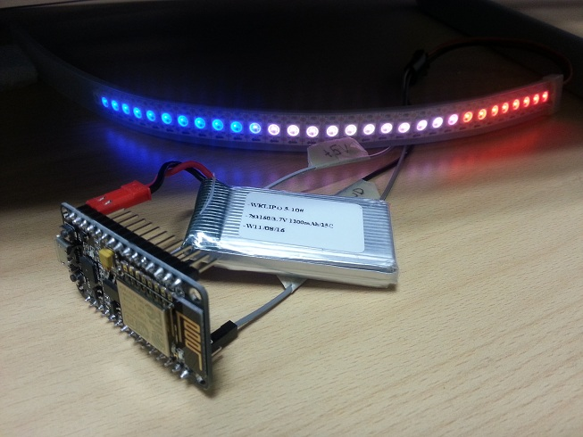

# Christmas Lights

Addressable LED strip controlled by NodeMCU (ESP8266). 



## Connection Diagram

Note D0 and RST lines must be disconnected when uploading firmware.

```
                                NodeMCU                                                 LED Strip

                           +--------------+                                            +--------+
                           |        D1 (5)|  +-------+  PWM        3.7V    +--------+  | 3.7V   |
                           |              |                                            |        |
+-------------+  +------+  | GND    GND   |  +-------+  GND        PWM     +--------+  | PWM    |
|3.7V Battery |            |              |                                            |        |
+-------------+  +------+  | VIN    3.3V  |  +-------+  3.3V       GND     +--------+  | GND    |
                           +--------------+                                            +--------+

			    Rpi
             		   +--------+
             USB +------+  | USB    |
			   |        |
			   +--------+

*** Missing ***
Wire D0 to RST (to wake up device from deep sleep)
```      

## Code

ChristmasLights.ino runs on NodeMCU and polls Rpi. crontab runs on Rpi, generating file /var/www/html/xmas-lights.php.

## Roadmap

* Change sleep pattern
** Sleep outside office hours
** wake up every hour until lunchtime
** wake up every ten minutes during lunchtime
* Add mp3 player
* Migrate to ESP32
* Change Arduino request job task to "close" open job once finished
