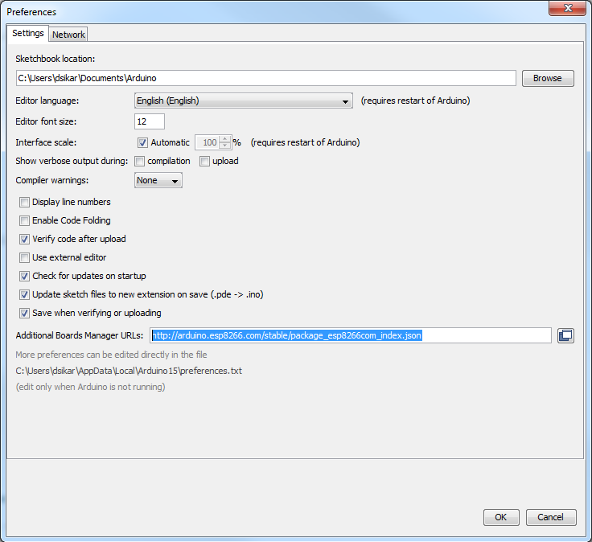
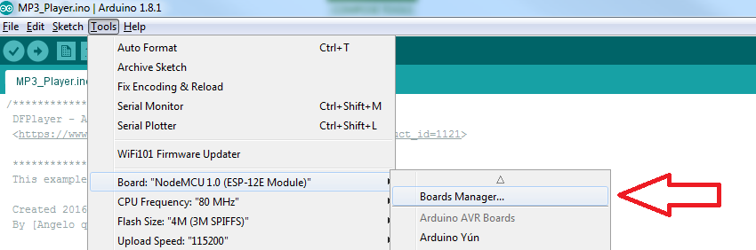

# Setting up the NodeMCU with Arduino IDE

Steps to get the NodeMCU up and running with Arduino IDE:

* Install the board in your Arduino IDE - you open the IDE then from **File > Preferences** add this string:

```
http://arduino.esp8266.com/stable/package_esp8266com_index.json
```
to the “Additional Boards Manager URLs:” textbox and click OK. <br>

 <br>

* Next go to **Tools > Board: > Boards Manager**

 <br>
